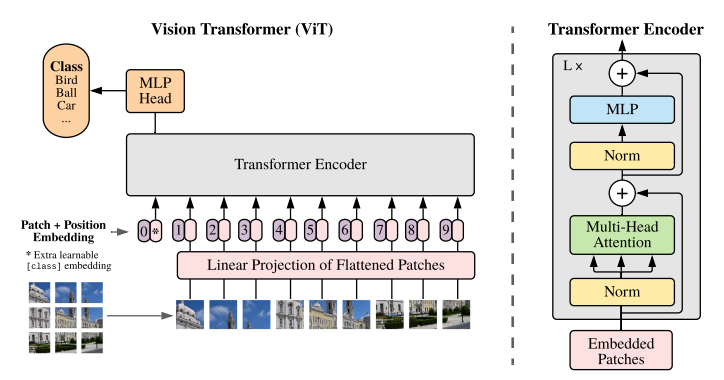

# Vision Transformer

Este proyecto implementa un modelo **Vision Transformer (ViT)** utilizando únicamente **C++** y apuntando al uso de **CUDA**. La implementación es educativa y busca comprender los fundamentos del paper ["An Image is Worth 16x16 Words: Transformers for Image Recognition at Scale" (Dosovitskiy et al., 2020)](https://arxiv.org/pdf/2010.11929).

A diferencia de las redes neuronales convolucionales tradicionales, este enfoque transforma una imagen en pequeños *patches* que son procesados como secuencias, permitiendo el uso de la arquitectura Transformer originalmente diseñada para tareas de procesamiento de lenguaje natural.

## Objetivo

El objetivo principal es explorar cómo los Transformers pueden aplicarse al reconocimiento visual desde cero, sin depender de frameworks de alto nivel, y acelerando el entrenamiento e inferencia mediante **CUDA** y **programación en bajo nivel con C++**.

## ¿Qué es Vision Transformer?

El **Vision Transformer (ViT)** divide una imagen en bloques fijos (por ejemplo, de 16x16 píxeles), los aplane y los trate como "palabras" o tokens. Estos tokens se procesan mediante una serie de capas Transformer, seguidas por una capa final de clasificación.

### Características clave:
- División de imágenes en *patches*.
- Uso de embeddings aprendidos para cada patch.
- Inserción de un token especial `[CLS]` para la clasificación.
- Uso de atención multi-cabeza y posiciones absolutas aprendidas.

## Referencias

- [An Image is Worth 16x16 Words: Transformers for Image Recognition at Scale](https://arxiv.org/pdf/2010.11929)
- [Attention Is All You Need](https://arxiv.org/abs/1706.03762)
